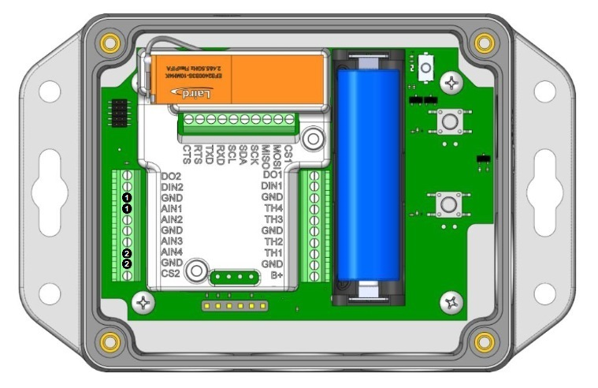

# Canvas Device Manager BT610 Configuration Templates

## Pressure and Ultrasonic - pressure sensor on AIN1 and ultrasonic sensor on AIN4

This configuration template defines the parameter settings needed to configure a BT610 IoT sensor for usage with one pressure sensor on input AIN1 and one ultrasonic sensor on AIN4.

Wiring points for the sensors are shown below.

Further details of sensor wiring can be found in the [BT610 Hardware Configuration and Installation Guide][BT610 Hardware Configuration and Installation Guide].

---
**_Note:_** Sensor measurement intervals will consume increasing gateway bandwidth with decreasing duration. The values provided here are for illustrative purposes only and should be evaluated for the purposes of the local system requirements.

---

---
**_Note:_** Only one ultrasonic sensor can be connected to the BT610.

---

---
**_Note:_** Only one pressure sensor can be connected to the BT610 when an ultrasonic sensor is in use.

---

---
**_Note:_** Pressure sensors can be connected to any AIN input, but the appropriate analog_input_type parameter must be configured accordingly.

---

---
**_Note:_** Ultrasonic sensors can be connected to any AIN input, but the appropriate analog_input_type parameter must be configured accordingly.

---

[BT610 Hardware Configuration and Installation Guide]: <https://www.lairdconnect.com/documentation/bt610-hardware-configuration-and-installation-guide>
