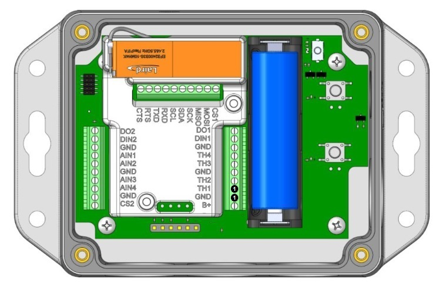

# Canvas Device Manager BT610 Configuration Templates

## Thermistor - single thermistor on TH1

This configuration template defines the parameter settings needed to configure a BT610 IoT sensor for usage with one thermistor on input TH1.

Wiring points for the sensor are shown below.

Further details of sensor wiring can be found in the [BT610 Hardware Configuration and Installation Guide][BT610 Hardware Configuration and Installation Guide].

---
**_Note:_** Sensor measurement intervals will consume increasing gateway bandwidth with decreasing duration. The values provided here are for illustrative purposes only and should be evaluated for the purposes of the local system requirements.

---

---
**_Note:_** Thermistors can be connected to any TH input, but the thermistor_config parameter must be configured accordingly to reflect the input(s) in use.

---

[BT610 Hardware Configuration and Installation Guide]: <https://www.lairdconnect.com/documentation/bt610-hardware-configuration-and-installation-guide>
